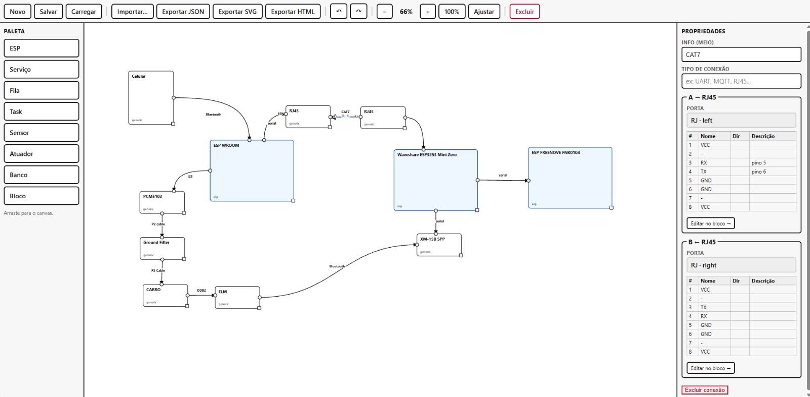

# Car Unified Dash

Unified automotive dashboard for a **Volvo C30**, combining audio control, OBD‑II telemetry, and a graphical interface into a single, distributed system built on three ESP32 microcontrollers.



## Overview

The project merges two previously separate systems:

*   **Audio module** – a WROOM‑based Bluetooth A2DP sink with FFT analysis and media‑key control.
*   **Display module** – an ESP32‑S3 (FREENOVE) driving a 480×320 ST77922 screen, with touch and a multi‑screen UI.

A third ESP32‑S3 (**mini router**) acts as the central hub, routing commands, aggregating telemetry, and bridging the two ends.

All three boards communicate over a custom binary protocol (UART, 115200 8N1) and the system is designed to be robust, low‑latency, and easily extensible.

## Architecture

```
┌─────────────┐      UART      ┌─────────────┐      UART      ┌─────────────┐
│   WROOM     │ <───────────> │ Mini Router │ <───────────> │  FREENOVE   │
│  (Audio)    │               │   (Hub)     │               │  (Display)  │
└─────────────┘               └─────────────┘               └─────────────┘
       │                             │                              │
       │ I2S                         │ Wi‑Fi (Web/WS)               │ Touch
       ▼                             ▼                              ▼
   Amplifier /                  Web dashboard                 GUI (ST77922)
   Bluetooth A2DP               & OBD‑II (BT)                 (480×320)
```

*   **WROOM** – Handles Bluetooth audio (A2DP sink), computes FFT bands, and processes media keys.
*   **Mini Router** – Central hub: routes media commands from the display to the WROOM, aggregates OBD‑II data via an XM‑15B Bluetooth module, manages Wi‑Fi, and forwards telemetry to the display at 30 Hz.
*   **FREENOVE** – Renders the dashboard, handles touch input, and displays real‑time data (RPM, boost, consumption, FFT bars, music metadata, etc.).

### Data Flow

1.  **Media keys** – FREENOVE → Mini → WROOM (UART)
2.  **FFT + Music metadata** – WROOM → Mini → FREENOVE (UART)
3.  **Telemetry (OBD‑II)** – ELM327 → XM‑15B (BT) → Mini → FREENOVE (UART)
4.  **Wi‑Fi configuration** – FREENOVE → Mini (UART) → saves credentials in NVS

## Hardware

| Component       | Board / Module       | Role                                | Key Pins / Interfaces               |
| --------------- | -------------------- | ----------------------------------- | ----------------------------------- |
| Audio           | ESP32 WROOM          | Bluetooth A2DP sink, FFT analysis   | I2S (SCK=25, SDOUT=26, WS=27)       |
| Hub             | ESP32‑S3 Mini        | Routing, OBD‑II, Wi‑Fi              | UART0 (XM), UART1 (WROOM), UART2 (FREENOVE) |
| Display         | FREENOVE ESP32‑S3    | GUI, touch                          | ST77922 (480×320), touch            |
| OBD‑II          | XM‑15B Bluetooth     | ELM327 bridge                       | UART 115200                         |
| Audio Amplifier | PCM5102 / WM8960     | DAC                                 | I2S                                 |

## Protocol

A lightweight framed protocol is used over UART:

```
[0xAA][0x55][TYPE][LEN][PAYLOAD...]
```

Common message types:

| Type  | Direction      | Description                         |
| ----- | -------------- | ----------------------------------- |
| 0x01  | WROOM → Mini   | FFT bands (32 bytes)                |
| 0x02  | WROOM → Mini   | Music metadata                      |
| 0x03  | Mini → WROOM   | Media command (Prev, Play, Next, Volume) |
| 0x04  | Mini → FREENOVE| Telemetry (float array + flags)     |
| 0x05  | Mini → FREENOVE| OBD‑II PID status (1 Hz)            |
| 0x10  | Mini → FREENOVE| Wi‑Fi status                        |
| 0x14  | FREENOVE → Mini| Button event                        |
| 0x30  | FREENOVE → Mini| Wi‑Fi query                         |
| 0x32  | FREENOVE → Mini| Wi‑Fi connect request               |
| 0x35  | FREENOVE → Mini| Force OBD‑II re‑negotiation         |

The protocol is implemented in the `uart_router.cpp` files on both the Mini and FREENOVE sides.

## Repository Structure

```
car_unified_dash/
├── car_audio_module/       # WROOM audio firmware
├── mini_router/            # Mini hub firmware
├── src/
│   ├── common/             # Shared structs (telemetry, audio, config)
│   ├── core/               # Display, touch, mode manager, UART router
│   ├── screens/            # UI screens (home, menu, OBD, Wi‑Fi, logs)
│   ├── sources/            # Mock data source for development
│   └── widgets/            # Gauges, bars, FFT visualizers
├── car_unified_dash.ino    # FREENOVE main firmware
├── topology.png            # System topology diagram
└── README.md
```

## Building & Flashing

### WROOM (Audio)

*   Open `car_audio_module/car_audio_module.ino` in Arduino IDE.
*   Board: **ESP32 Dev Module**.
*   Libraries: `ESP32-A2DP`, `arduinoFFT`.
*   Flash and connect I2S DAC.

### Mini Router

*   Open `mini_router/mini_router.ino`.
*   Board: **ESP32S3 Dev Module** (or Waveshare ESP32‑S3 Mini).
*   Libraries: `ESPAsyncWebServer`, `AsyncTCP`, `ArduinoJson`, `Preferences`.
*   Configure Wi‑Fi credentials via the on‑screen Wi‑Fi menu (stored in NVS).

### FREENOVE (Display)

*   Open `car_unified_dash.ino`.
*   Board: **ESP32S3 Dev Module**.
*   Libraries: `TFT_eSPI`, `ST77922`, `ArduinoJson`.
*   The display driver is configured for the 480×320 ST77922 panel.

## Usage

*   **Media control** – Use the on‑screen buttons or the physical buttons on the mini.
*   **Wi‑Fi setup** – Go to the Wi‑Fi screen on the display, enter SSID/password, and connect.
*   **OBD‑II** – The mini automatically initializes the ELM327 and starts polling PIDs.
*   **Telemetry** – The dashboard shows RPM, speed, boost, consumption, FFT, and music info.

## Development

*   The codebase is a unification of two previously separate projects: the audio module and the display module.
*   The Mini router acts as a message broker: it receives packets from one UART and forwards them to the other.
*   For testing without hardware, set `USE_MOCK 1` in `src/common/config.h` to feed simulated data.

## Credits

Developed by **Gabriel** (gfsgabriel) with assistance from **DeepSeek** AI.

## License

This project is for personal use. Please contact the author for licensing inquiries.